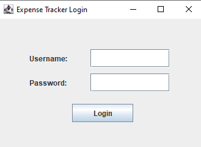
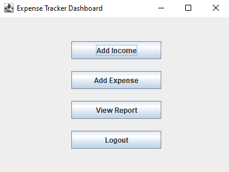
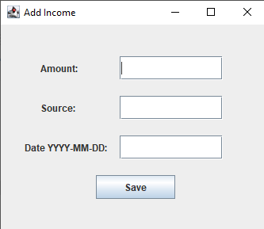
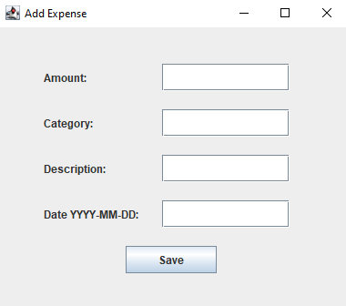
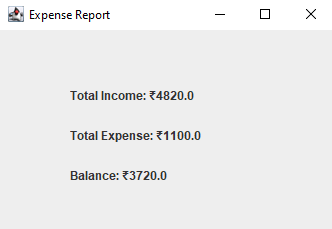

# Expense Tracker System

## Project Description

Expense Tracker System is a Java-based desktop application developed using Java, JDBC, and MySQL. The project helps users manage their income and expenses, maintain financial records, and generate balance summaries.

## Features

* User Login System
* Add Income Records
* Add Expense Records
* Store Data in MySQL Database
* View Financial Reports
* Calculate Total Income, Expenses, and Balance
* Database Connectivity using JDBC

## Technologies Used

* Java
* MySQL
* JDBC
* NetBeans IDE
* Git & GitHub

## Project Structure

* DBConnection.java
* TestConnection.java
* Login.java
* Dashboard.java
* AddIncome.java
* AddExpense.java
* Report.java

## Screenshots
### Login Screen

### Dashboard

### Add Income

### Add Expense

### Report

## Author
Minakshi Sharma
BCA Student | DAV Centenary College, Faridabad

## GitHub Repository

Expense Tracker System developed as a beginner-level real-world project for learning Java, Database Management, and GitHub.

